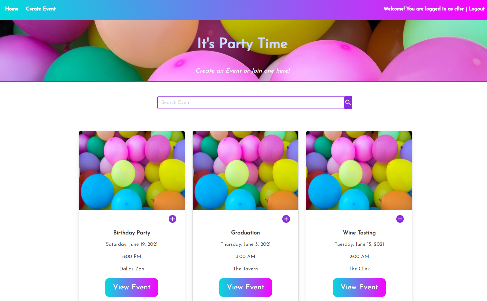

#  Mullet Events
## 
## Description 
The Mullet Events application will allows to create and manage events. Users can both host and sign up to attend events. Events have action lists that contain action items. The action lists are used to manage tasks and to do lists that attendees can view and manage. The centralized planning tools of Mullet Events allow users to share the work of planning successful parties and events.
## Table of Contents
- [Installation](#installation)
- [Usage](#usage)
- [Screenshot](#screenshot)
- [Screencast](#screencast)
- [License_Details](#license_details)
- [Contributing](#contributing) 
- [Tests](#tests)
- [Questions](#questions)
## Installation
To install the necessary dependencies run:

npm i

Run "npm i", then "npm start" to run the development server locally. Access the deployed version at: https://mullet-events.herokuapp.com/
## Usage
Create user/login. View events. Create events. View event details to voluneer to help or to communicate about the event planning.

## Screenshot

## License_Details

This project is licensed through: MIT

## Contributing

Anthony Castillo, Coleen Stuhlfire, Caitlyn Miley

## Tests

Run the application and report bugs.

## Questions

If you have questions about the repo, open an issue or contact me at 
cstuhlfire@gmail.com. You can find this project along with my other work 
at https://github.com/cstuhlfire.

